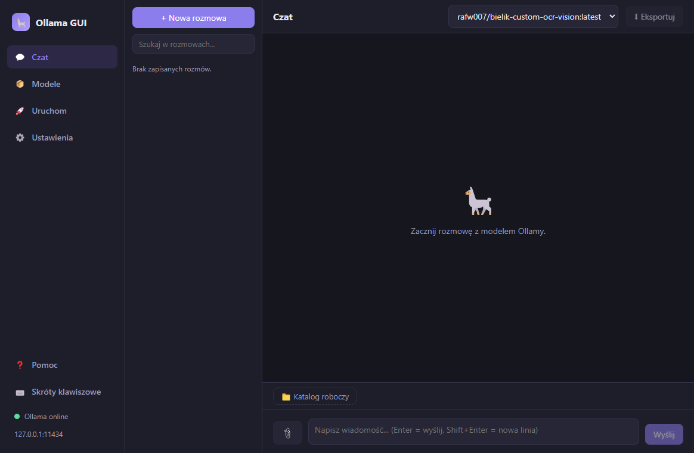
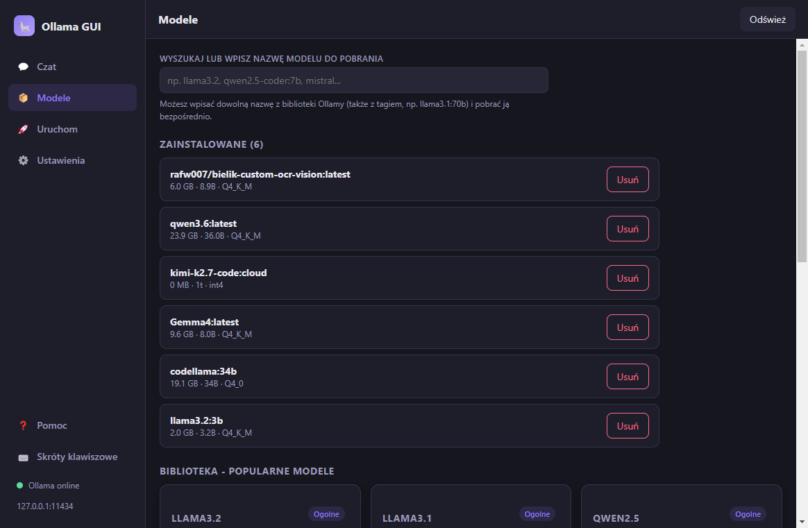
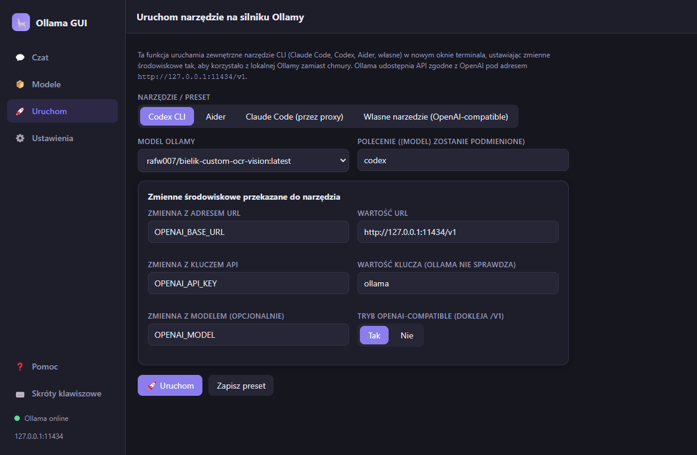
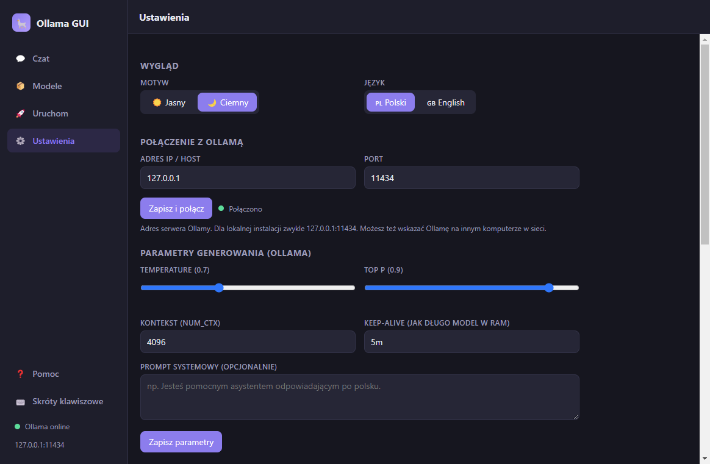
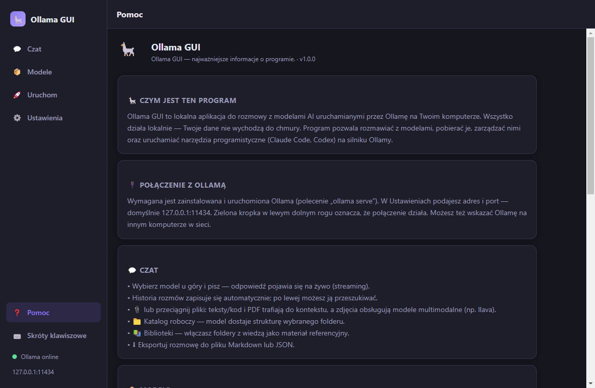

# Ollama GUI

Lokalne GUI dla [Ollamy](https://ollama.com) na Windows — zbudowane w Electron + React + TypeScript.

📥 **[Pobierz instalator (Releases)](https://github.com/zetmar-collab/ollama-gui/releases/latest)**

## Zrzuty ekranu

| Czat | Modele |
|:---:|:---:|
|  |  |
| **Uruchom (Claude Code / Codex)** | **Ustawienia** |
|  |  |



## Funkcje

- **💬 Czat** — okno rozmowy ze streamingiem odpowiedzi i wyborem modelu z listy. Historia rozmów
  (autozapis, wczytywanie, usuwanie). **Załączniki**: pliki tekstowe/kod (trafiają do kontekstu) i
  **zdjęcia** (dla modeli multimodalnych, np. llava). **Katalog roboczy** — struktura wybranego
  folderu podawana modelowi. **Biblioteki wiedzy** — foldery z dokumentami włączane jako materiał
  referencyjny.
- **📦 Modele** — wyszukiwanie w katalogu popularnych modeli, pobieranie po nazwie (z paskiem
  postępu), lista zainstalowanych modeli i ich usuwanie.
- **🚀 Uruchom** — odpalanie narzędzi CLI (Codex, Aider, Claude Code, własne) w nowym oknie
  terminala, z Ollamą jako silnikiem. Claude Code działa przez wbudowane **proxy Anthropic↔Ollama**.
- **⚙️ Ustawienia** — motyw jasny/ciemny, adres IP + port Ollamy, parametry generowania
  (temperature, top_p, num_ctx, keep-alive, prompt systemowy), sterowanie proxy i biblioteki wiedzy.

## Wymagania

- [Node.js](https://nodejs.org) 18+ (masz 24 ✓)
- [Ollama](https://ollama.com) uruchomiona lokalnie (`ollama serve`) — domyślnie `127.0.0.1:11434`

## Uruchomienie (tryb deweloperski)

```bash
npm install
npm run dev
```

## Budowa instalatora .exe (Windows)

```bash
npm run dist
```

Instalator pojawi się w folderze `release/`.

## Architektura

```
src/
  shared/      # typy i katalog modeli wspólne dla całości
  main/        # proces główny Electron (Node): IPC, klient Ollamy, runner
  preload/     # bezpieczny most contextBridge (window.api)
  renderer/    # UI w React (czat, modele, runner, ustawienia)
```

Komunikacja z Ollamą odbywa się przez jej REST API (`/api/chat`, `/api/tags`, `/api/pull`,
`/api/delete`, `/api/version`) w procesie głównym; renderer nie ma bezpośredniego dostępu do sieci
ani Node (contextIsolation + brak nodeIntegration).
